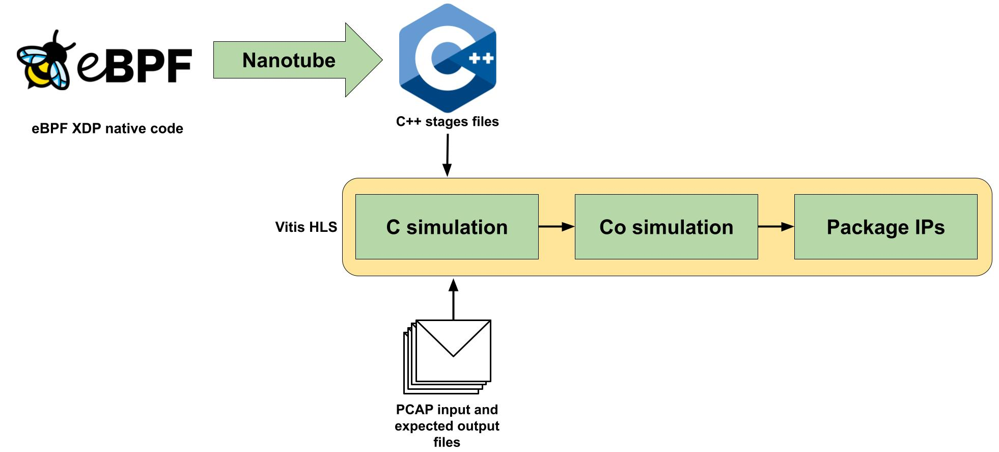
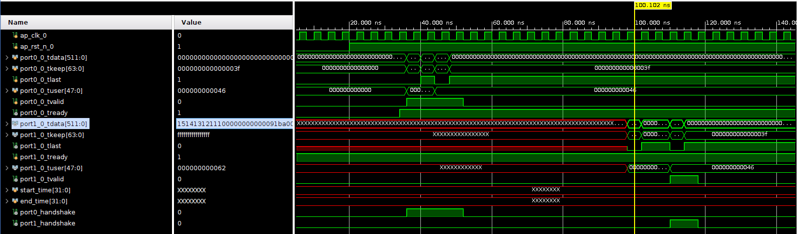

# Custom Applications for Nanotube

This directory contains custom applications to use with the Nanotube project, enabling the creation and testing of custom pipelines.

Each application folder is structured as follows:

```
.
├── name_of_the_application/
│   ├── pcap_test_files/
|   |   ├── pcap.IN
│   |   └── pcap.OUT
│   ├── Vivado_testbench/
│   |   └── pipeline_tb.v
│   ├── xdp_application.c
│   ├── application.c
│   └── compile.sh
```

More support files can be present, depending on the application requirements.

## File Descriptions

- **`application.c`**: Contains the source code for the application.
- **`compile.sh`**: Contains the commands to compile the application. You can also specify the name of the bus that the application will use.
- **`pcap_test_files/pcap.IN`**: Contains the input packets for the eBPF application compiled with Nanotube.
- **`pcap_test_files/pcap.OUT`**: Contains the expected output packets for the eBPF application compiled with Nanotube.
- **`Vivado_testbench/pipeline_tb.v`**: Contains the testbench for the application, used to verify the functionality of the pipeline in Vivado.

## Compilation & Simulation Instructions

To compile an application, after you have cloned and built the Nanotube project, follow these steps:

1. Copy the entire `Custom_applications` folder into the Nanotube project directory.
2. Open a terminal and navigate to the folder of the application you want to compile.
3. Run the following command:

   ```bash
   ./compile.sh
   ```

4. Some applications may require the Katran library. Follow the instructions in the README file present in the Nanotube repository to download and patch Katran prior to compiling the application.
5. If the compilation is successful, a folder ending with `_hls` will be created inside the application folder. This folder contains the C++ stage files required to create a custom pipeline with HLS plus a file containing the link between the inputs and outputs of the IPs.

To perform HLS synthesis, you can use the `scripts/hls_build` command provided by Nanotube. The command should look like this:

```bash
scripts/hls_build -j6 --clock 4.0 -p xcu250-figd2104-2L-e -- Custom_applications/xdp_drop_IPv4/xdp_drop_IPv4.ebpf2nt.mem2req.lower.inline.platform.ntattr.optreq.converge.pipeline.link_taps.inline_opt.hls/  HLS_build/xdp_drop_IPv4/
```

This command generates the Vivado IPs in the `HLS_build` directory with a clock target of 250 MHz and for the Alveo U250 board. You can change options as needed.

### Notes

- Ensure the **bus name** and **application name** are correctly specified in the `compile.sh` file.
- If you encounter any issues during the synthesis and simulation phase, check the stage log files inside the output directory to better understand the issue. Keep in mind that you can also modify the c++ initial files to print some debugging information inside the log files.

# Simulating and Testing the Application

## How to test the XDP application in Software

Before deploying the application on the FPGA, you can test it locally on your machine. To do so, follow these steps:

1. Install the required dependencies:

   ```bash
   sudo apt install -y clang llvm libbpf-dev libelf-dev iproute2
   sudo apt install -y linux-headers-$(uname -r)
   ```

2. Compile the application:

   ```bash
   clang -target bpf -O3 -c xdp_application.c -o xdp_application.o
   ```

3. Load the application using the `ip` command:

   ```bash
   sudo ip link set dev <interface> xdp obj xdp_application.o sec <xdp>
   ```

   Note: Replace `<interface>` with the name of the network interface you want to attach the XDP program to and `<xdp>` with the section name specified in the application.

4. To check if the application is loaded, run:

   ```bash
   sudo ip link show <interface>
   ```

5. Now, create a packet generator to send packets to the interface and observe the behavior of the application. Sometimes a simple ping command can be enough to test the application.

6. To unload the application, run:

   ```bash
   sudo ip link set dev <interface> xdp off
   ```

## How to test the XDP application in Vitis HLS



Before synthesizing a design into hardware, simulation is a crucial step to verify its functional correctness. Vitis HLS provides two main types of simulation: **C Simulation (C-Sim)** and **C/RTL Co-Simulation (Co-Sim)**.

- **C Simulation** runs the C/C++ design and testbench purely in software to validate the algorithm’s behavior.
- **Co-Simulation** runs the same testbench against the generated RTL to ensure the hardware implementation matches the original C model.

Alongside the generated C++ files, Nanotube also generates a file named `poll_thread.cc`, which contains information about the structure of the pipeline so it can be reproduced within Vitis HLS. To run the simulation, use the following command:

```bash
scripts/hls_build -j6 --clock 4.0 -p xcu250-figd2104-2L-e -- Custom_applications/xdp_drop_IPv4/xdp_drop_IPv4.ebpf2nt.mem2req.lower.inline.platform.ntattr.optreq.converge.pipeline.link_taps.inline_opt.hls/ HLS_build/xdp_drop_IPv4/ --pcap-in ../../../../../../Custom_applications/xdp_drop_IPv4/pcap_test_files/test_xdp_drop_IPv4.pcap.IN --pcap-exp ../../../../../../Custom_applications/xdp_drop_IPv4/pcap_test_files/test_xdp_drop_IPv4.pcap.OUT
```

This command is similar to the one used for synthesis, but now includes a pair of pcap files: one for the input and one for the expected output. As shown in the image above, this command performs both **CSim** and **CoSim** using the provided pcap files and compares the simulation output with the expected output. If the comparison is successful, it proceeds to generate the Vivado IP cores in the `HLS_build` directory. You can also customize the target board and other build options as needed.

This functionality is extremely useful because it allows you to modify the stage `.cc` files with custom code—for example, to print debug information and better understand whether your design is behaving as expected. You can insert lines like:

```cpp
hls::print("\n--- Cycle %u ---\n", cycle);
```

These lines will be executed during simulation, and the output will appear in the log file corresponding to the modified stage. So if you add this line to `stage_4.cc`, after running the `hls_build` command, you'll find the debug information inside the generated `stage_4.log` file.

## How to test the XDP application in Vivado

Additionally, you may want to simulate the pipeline in Vivado. Inside each application folder there is a testbench that simulates the exact same packets contained inside the pcap.IN files. In order to run the simulation, follow these steps:

1. Open Vivado and open the OpenNIC-shell project with the custom pipeline inserted.
2. Inside the project, add the testbench from the `Vivado_testbench` folder of the application you want to simulate.
3. Make sure to set the correct simulation top module in the Vivado settings and to correctly target your pipeline. To do so right click on the testbench file inside the "Simulation Sources" folder in the Sources tab and select "Set as Top". This will ensure that Vivado uses the correct module for simulation. If you open the tree view of the testbench, you should see the pipeline block design instantiated inside it.
4. Now press "Run Simulation" and "Run Behavioral Simulation" to run the testbench and examine the behavior of the Pipeline.

The expected output should match the packets in the `pcap_test_files/pcap.OUT` file. If there are any discrepancies, check the testbench and the application code for potential issues. This is an example of the expected output:



### Notes

- When you try to run the **Behavioral Simulation** in Vivado, you may encounter an error stating that files like `bd_7485_lmb_bram_0.mem` or `bd_7485_reg_map_bram_0.mem` are missing. If this happens, simply create an empty file with the same name to allow Vivado to initialize that memory region to zero. Credit: Thanks to **Francesco Maria Tranquillo** for this helpful insight.
- Pay attention to how you insert the packet data inside the tdata signal in the Vivado testbench. The data should be inserted in the correct order, otherwise the simulation will fail. There is a python script called `../scripts/reverse_pairs.py` that can help you with this task. It takes a packet formatted as a string as input and outputs a new string with the data reversed in pairs, which is the expected format for the tdata signal in the Vivado testbench.
- For any problems, here is a brief showcase of the Vivado project complete and working: [Link](https://youtu.be/lFHE5LJilow)
