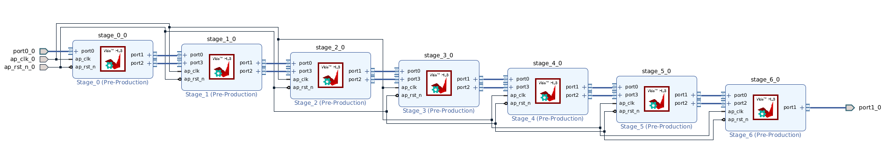
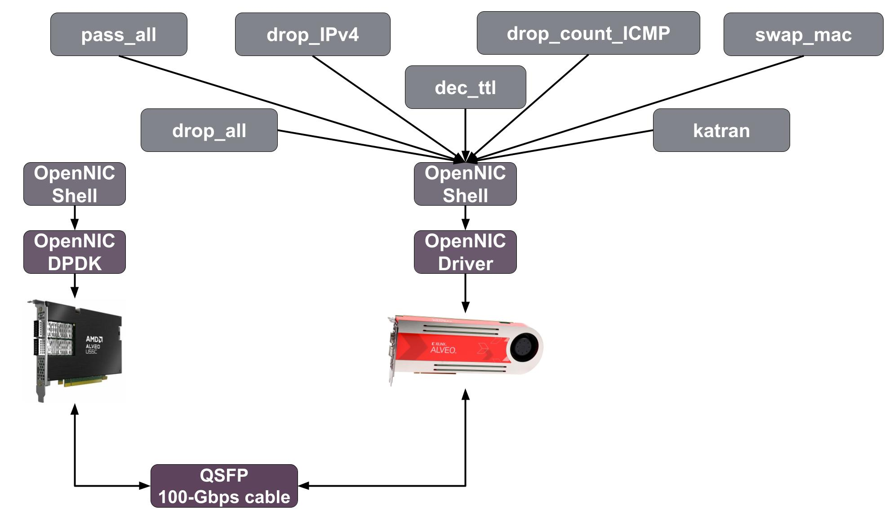

# NanoNIC

## Project Goal

The **NanoNIC** project integrates **Nanotube**, a compiler for translating eBPF programs into FPGA-friendly hardware descriptions, with **OpenNIC**, an open-source framework for programmable network interface cards. The goal is to enable hardware-accelerated, high-performance eBPF-based packet processing even for developers who are not so friendly with the development process of FPGA.

This project provides a proof-of-concept system demonstrating how to:

1. Translate eBPF programs into FPGA bitstreams using **Nanotube** and **High-Level Synthesis (HLS)**.
2. Utilize **OpenNIC** to interface with network traffic and manage FPGA-host communication.
3. Compare the performance of FPGA-accelerated eBPF programs with general-purpose CPU execution.

## Project Description

### Components

This project includes the following components:

1. **Bus Implementation:**

   - Nanotube doesn't official support the OpenNIC bus interface so we added it to the official repository.

2. **Wrapper Implementation:**

   - The wrapper connects **OpenNIC** and **Nanotube**-generated IPs.

3. **eBPF Programs:**
   - A set of eBPF programs for testing the system. Inside the Custom_applications folder you can find the eBPF programs that we used for testing. Plus also a script for compiling every eBPF program with Nanotube and a guide that describes how to compile, execute and test each program before deploying it on the FPGA.

### Bugs fixed

- Nanotube compiler only support a version of AXI4-Stream that comprend also the `tstrb` signal, which is not necessary for OpenNIC. The issue has been communicated to the Nanotube team and they will fix this issue ([Github Issue](https://github.com/Xilinx/nanotube/issues/2)). For now, the problem is solved by the `Nanotube_pipeline_wrapper.v` file, which handles the `tstrb` signal.
- The HLS script provided by Nanotube does not work with the xdp_drop_all application because it does not support applications that have no output. To solve this issue, follow the instruction in the [Github Issue](https://github.com/Xilinx/nanotube/issues/3).

### Prerequisites

To build and deploy the NanoNIC system, ensure the following are installed:

- **Xilinx Vivado** (v2022.1) for FPGA synthesis and implementation.
- **Ubuntu 20.04** with kernel development tools.

The building process often requires a great amount of RAM installed. If you don't have 64 GB available, make sure to dimension the swapfile in order to reach that amount. (Look [here](https://askubuntu.com/questions/178712/how-to-increase-swap-space) for a guide).

Both Nanotube and the OpenNIC shell are linked as submodules to this repository so just run this command in order to download them:

```shell
git submodule update --init --recursive
```

Now, you can apply the patch created for Nanotube repository. To do so, run the following command:

```shell
patch -d ./nanotube -p1 < nanotube.patch
```

For the OpenNIC shell, you need to execute the file named `synth_open-nic_project.sh` . This will create the necessary files for the Vivado project. Before,

```shell
./synth_open-nic_project.sh
```

The compilation is going to take a while so you can take a break and come back later. After the compilation is done, you can open the Vivado project and start working on the FPGA design.

### [Nanotube](nanotube/README.md)

Here is a simple representation of the Nanotube compiler:


Nanotube is created to translate eBPF programs into a series of C++ files that can be synthesized into hardware using High-Level Synthesis (HLS).

Once the patch is applied, you can follow the instructions in the Nanotube README to build the compiler. The patch file contains the necessary modifications to support the OpenNIC bus interface. The following buses are currently supported:

- **`sb`**: Simple Bus
- **`shb`**: SoftHub Bus
- **`x3rx`**: X3RX Bus (X3522 SmartNICs)
- **`open_nic`**: OpenNIC Bus

Inside the `Custom_applications` directory, you can find more information about how to compile the eBPF programs with Nanotube. The process is quite simple and can be done by running the `compile.sh` script present in each application directory. The script will compile the eBPF program and generate the necessary C++ files for HLS synthesis.

After the HLS synthesis is done, you can find the IPs in the output directory. You can now move the IPs to the OpenNIC shell directory and start building the FPGA design.

### [OpenNIC-shell](open-nic-shell/README.md)

The OpenNIC shell is a framework that allows developers to create a custom NIC with a custom pipeline. For more information please visit the OpenNIC repository.

In order to build the OpenNIC shell with our custom IP inside, some modifications are needed. First of all, execute the `synth_open-nic_project.sh` file and generate a Vivado project of the OpenNIC shell. Then, press Tools -> Settings -> IP -> Repository and add the path to the `nanotube/HLS_build/application` directory. You should see some new IPs added to the project. After that, you can create a new block design and add all IP by pressing the "+" button and selecting all the IPs that are called `stage_{number}`. Inside the output directory created by Nanotube with the C++ stage files, you will also find a `vitis_opts.ini` file that contains all the necessary links that you need to reproduce inside the Block design. Here is an example of how the `vitis_opts.ini` file looks like:

```
[connectivity]
nk=stage_0:1:stage_0
nk=stage_1:1:stage_1
nk=stage_2:1:stage_2
nk=stage_3:1:stage_3
nk=stage_4:1:stage_4
nk=stage_5:1:stage_5
nk=stage_6:1:stage_6
sc=mae2p_kernel0:stage_0.port0
sc=stage_0.port1:stage_1.port0:16
sc=stage_1.port1:stage_2.port0:16
sc=stage_2.port1:stage_3.port0:16
sc=stage_3.port1:stage_4.port0:16
sc=stage_4.port1:stage_5.port0:16
sc=stage_5.port1:stage_6.port0:16
sc=stage_6.port1:p2vnr_kernel0
sc=stage_0.port2:stage_1.port3:16
sc=stage_1.port2:stage_2.port3:16
sc=stage_2.port2:stage_3.port3:16
sc=stage_3.port2:stage_4.port3:16
sc=stage_4.port2:stage_5.port3:16
sc=stage_5.port2:stage_6.port2:16
```

If a port is not connected to other ports of the pipeline (e.g. mae2p_kernel0 or p2vnr_kernel0), right click on it and press "Make it external". At this point you should connect all the clock and reset ports together and the result should be a block design that looks like this:



Now, you can let Vivado create the wrapper for you. This file is essential to connect the OpenNIC shell with the custom pipeline. Since the IPs generated by Nanotube include also a `tstrb` signal that is useless in the OpenNIC context, you can fix it by looking at the example file named `Nanotube_pipeline_wrapper.v`. After that, you can connect the pipeline to the OpenNIC shell by changing the `p2p_250mhz.sv` file inside Vivado. Replace line 282 where the rx_ppl_inst is connected to an axi_stream_pipeline and use the custom pipeline that you created. The file should look like this:

```verilog
axi_stream_pipeline tx_ppl_inst (
   .s_axis_tvalid (s_axis_qdma_h2c_tvalid[i]),
   .s_axis_tdata  (s_axis_qdma_h2c_tdata[`getvec(512, i)]),
   .s_axis_tkeep  (s_axis_qdma_h2c_tkeep[`getvec(64, i)]),
   .s_axis_tlast  (s_axis_qdma_h2c_tlast[i]),
   .s_axis_tuser  (axis_qdma_h2c_tuser),
   .s_axis_tready (s_axis_qdma_h2c_tready[i]),

   .m_axis_tvalid (m_axis_adap_tx_250mhz_tvalid[i]),
   .m_axis_tdata  (m_axis_adap_tx_250mhz_tdata[`getvec(512, i)]),
   .m_axis_tkeep  (m_axis_adap_tx_250mhz_tkeep[`getvec(64, i)]),
   .m_axis_tlast  (m_axis_adap_tx_250mhz_tlast[i]),
   .m_axis_tuser  (axis_adap_tx_250mhz_tuser),
   .m_axis_tready (m_axis_adap_tx_250mhz_tready[i]),

   .aclk          (axis_aclk),
   .aresetn       (axil_aresetn)
);

Nanotube_pipeline_wrapper rx_ppl_inst (
   .ap_clk_0       (axis_aclk),
   .ap_rst_n_0     (axil_aresetn),

   .port0_0_tvalid (s_axis_adap_rx_250mhz_tvalid[i]),
   .port0_0_tdata  (s_axis_adap_rx_250mhz_tdata[`getvec(512, i)]),
   .port0_0_tkeep  (s_axis_adap_rx_250mhz_tkeep[`getvec(64, i)]),
   .port0_0_tlast  (s_axis_adap_rx_250mhz_tlast[i]),
   .port0_0_tuser  (axis_adap_rx_250mhz_tuser),
   .port0_0_tready (s_axis_adap_rx_250mhz_tready[i]),

   .port1_0_tvalid (m_axis_qdma_c2h_tvalid[i]),
   .port1_0_tdata  (m_axis_qdma_c2h_tdata[`getvec(512, i)]),
   .port1_0_tkeep  (m_axis_qdma_c2h_tkeep[`getvec(64, i)]),
   .port1_0_tlast  (m_axis_qdma_c2h_tlast[i]),
   .port1_0_tuser  (axis_qdma_c2h_tuser),
   .port1_0_tready (m_axis_qdma_c2h_tready[i])
);
```

Now, you need to set as global the file named `open_nic_shell_macros.vh` and add the following lines at the end of the file:

```verilog
`define __au250__
`define __synthesis__
`undef __au55c__
`undef __au50__
`undef __au55n__
`undef __au200__
`undef __au280__
`undef __au45n__
```

Be sure to use define for synthesis and the correct target board. In this case the setup is configured for an Alveo U250.

The next step is to generate the bitstream by pressing the "Generate Bitstream" button. If you want to test the design instead, you can find more information in the `Custom_applications` directory.

## Testing Setup

To test the NanoNIC system, we used the following setup:



The U55C board was used to run the OpenNIC shell with DPDK support to generate traffic. The U250 board was used to run the OpenNIC shell with the custom pipeline generated by Nanotube. The two boards were connected via a 100G QSFP cable.

Inside the `scripts` folder, you can find a script named `setup_and_run_DPDK.sh`, which was used to automate the configuration and execution of DPDK on the U55C side. The parameters used within this script may vary depending on the bitstream, setup, and board used.

For an unknown reason, DPDK appears to work only with bitstreams that are generated with two CMAC ports. While the `lspci -v` command provides most of the information required for the script, some values—such as `0x8` and `0x00400008`—are derived from the configuration used by the `open-nic-driver`. It is recommended to insert the `open-nic-driver` kernel module, read the necessary values using a tool like `pcimem`, and manually copy them into your script.

Another unusual behavior observed during testing was that DPDK functioned correctly only after the `open-nic-driver` was inserted and then removed. Since this behavior is not typical for DPDK and may be setup-specific, it was not included in the configuration script.

## Warnings and Errors

Be careful when you try to emulate this project because a lot of things can go wrong. Here are some of the errors we found during the development:

- Sometimes in the Nanotube README file, the `nanotube-llvm` directory is missplelled. Make sure to correct it.
- In order to make scons work, you'll need to install python3-distutils package.
- If you have problems with installling Vivado, here is a guide to do it (https://www.reddit.com/r/Xilinx/comments/s7lcgq/comment/ib643pc/?utm_source=share&utm_medium=web3x&utm_name=web3xcss&utm_term=1&utm_content=share_button)
- You may encounter an error saying "Vivado "$RDI_PROG" "$@". The problem is that you may not have enought ram to run the program. You can try to increase the swapfile size or try to run the program in a machine with more ram.

## Limitations

Unfortunately, the current implementation has several limitations that you should be aware of:

1. The project is tested for the Xilinx Alveo U250 FPGA and may require modifications to support other FPGA platforms.

2. The Nanotube compiler currently supports only a subset of eBPF features (e.g. Per-cpu maps are not supported)

3. Big pipelines like the one of Katran (example used inside the Nanotube GitHub repository) fails to meet the timing constraints in the OpenNIC shell. As of today, we are still working on this issue.

## Roadmap

- [x] Integrate Nanotube with OpenNIC support and pass the repository tests.
- [x] Achieve a working implementation on FPGA.
- [ ] Test the hardware design in a real-world scenario.

## Acknowledgment

This project builds on the following:

- [AMD Nanotube](https://github.com/Xilinx/nanotube): A BPF-to-HDL compiler designed for hardware acceleration in networking applications.
- [OpenNIC](https://github.com/Xilinx/open-nic): A framework for building programmable Network Interface Cards (NICs), enabling advanced packet processing.
- [Xilinx Vivado](https://www.amd.com/en/products/software/adaptive-socs-and-fpgas/vivado.html): Development tools and platforms for implementing and testing FPGA-based designs.
