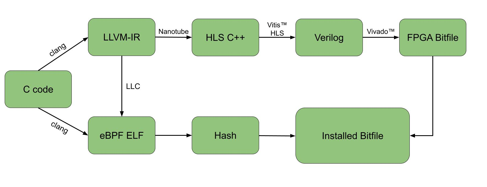
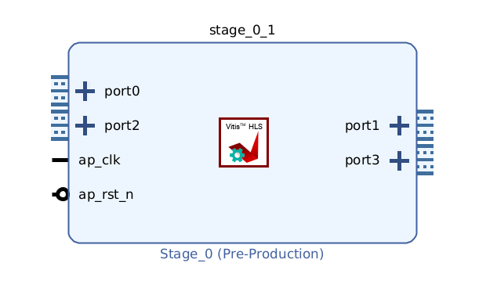
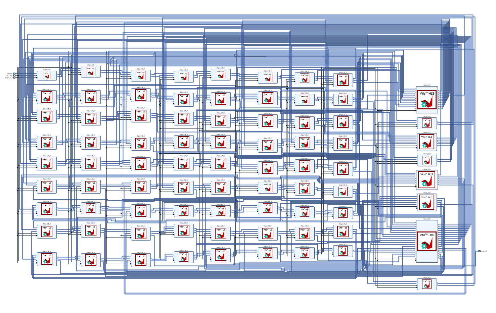

# NanoNIC

## Project Goal

The **NanoNIC** project integrates **Nanotube**, a compiler for translating eBPF programs into FPGA-friendly hardware descriptions, with **OpenNIC**, an open-source framework for programmable network interface cards. The goal is to enable hardware-accelerated, high-performance eBPF-based packet processing for modern networking use cases.

This project provides a proof-of-concept system demonstrating how to:

1. Translate eBPF programs into FPGA bitstreams using **Nanotube** and **High-Level Synthesis (HLS)**.
2. Utilize **OpenNIC** to interface with network traffic and manage FPGA-host communication.

---

## Project Description

### Components

This project includes the following components:

1. **Bus Implementation:**

   - Nanotube doesn't official support the OpenNIC bus interface so we added it to the official repository.

2. **Wrapper Implementation:**
   - The wrapper connects **OpenNIC** and **Nanotube**, enabling FPGA packet processing.

---

### Prerequisites

To build and deploy the NanoNIC system, ensure the following are installed:

- **Xilinx Vivado** (v2022.1) for FPGA synthesis and implementation.
- **Ubuntu 20.04** with kernel development tools.

The building process often requires a great amount of RAM installed. If you don't have 64 GB available, make sure to dimension the swapfile in order to reach that amount.

Both Nanotube and the OpenNIC shell are linked as submodules to this repository so just run this command in order to download them:

```shell
git submodule update --init --recursive
```

Now, you can apply the patch created for Nanotube repository. To do so, run the following command:

```shell
patch -d ./nanotube -p1 < nanotube.patch
```

Unfortunately, the shell.patch has some lines that depends from the user's environment so it is not possible to apply it automatically. You should use it as guide to apply the changes manually or fix all the paths that are not correct.

### [Nanotube](nanotube/README.md)

Here is a simple representation of the Nanotube compiler:



Once the patch is applied, you can follow the instructions in the Nanotube README to build the compiler, download katran and build the IPs with the HLS synthesis. Next, create an empty Vivado project and press Tools -> Settings -> IP -> Repository and add the path to the nanotube/hls/ directory. You should see some new IPs added to the project. After that, you can create a new block design and add all IP by pressing the "+" button and selecting all the IPs that are called stage{number}.

To perform the HLS synthesis, run this command inside the nanotube directory:

```shell
scripts/hls_build examples/katran/balancer_kern.O3.nt.req.lower.inline.platform.optreq.converge.pipeline.link_taps.inline_opt.hls HLS_build/katran -j 5 -L/usr/lib/x86_64-linux-gnu -L/usr/lib/gcc/x86_64-linux-gnu/9 -v
```

This is an example of an IP:



Inside the .hls build directory, you will find a `vitis_opts.ini` file that contains all the necessary links that you need to reproduce inside the Block design. If a port is not connected to anything, right click on it and press "Make it external". At this point you should connect all the clock and reset ports together and the result should be a block design that looks like this:



At this point, you can generate the wrapper for the block design by simply right clicking on the block design and pressing "Create HDL Wrapper". This will generate a new file that can be used to access the block design. The next step is to export the block design to the open-nic-shell project. To do so, place the block design inside the open-nic-shell/plugin/p2p/box_250mhz directory and rename it to `NK_open_nic`. If inside the folder there are some stub files, you can delete them.

### [OpenNIC-shell](open-nic-shell/README.md)

The OpenNIC shell is a framework that allows the user to create a custom NIC with a custom pipeline. For more information please visit the OpenNIC repository.

In order to build the OpenNIC shell with our custom IP inside, some modifications are needed. First of all, take a look at the `shell.patch` file. There you can find all the changes needed but you need to adapt the paths to your environment. After that, you can start the compilation by running this command inside the script folder:

```shell
vivado -mode tcl -source build.tcl -tclargs -board au250 -tag Nanotube_katran -jobs 8 -synth_ip 1 -impl 1 -use_phys_func 0 -sim 0
```

After this command has finished, in the `build` folder you should find a directory named `Nanotube_katran` with 2 folders inside. The folder named `open-nic-shell` contains the Vivado project of the OpenNIC shell. You can open it directly in Vivado to see the results.

## Warnings and Errors

Be careful when you try to emulate this project because a lot of things can go wrong. Here are some of the errors we found during the development:

- Sometimes in the Nanotube README file, the `nanotube-llvm` directory is missplelled. Make sure to correct it.
- There's also need to install python3-distutils package in order to make scons work.
- If you have problems with installling Vivado, here is a guide to do it (https://www.reddit.com/r/Xilinx/comments/s7lcgq/comment/ib643pc/?utm_source=share&utm_medium=web3x&utm_name=web3xcss&utm_term=1&utm_content=share_button)

## Limitations

Unfortunately, the current implementation has several limitations that you should be aware of:

1. The project is tested for the Xilinx Alveo U250 FPGA and may require modifications to support other FPGA platforms.

2. The Nanotube compiler currently supports only a subset of eBPF features (e.g. Per-cpu maps are not supported)

## Roadmap

- [ ] Achieve a working implementation on FPGA.
- [ ] Test the hardware design in a real world scenario.
- [ ] Create a new custom eBPF application and test the entire process with it.

## Acknowledgment

This project builds on the following:

- [AMD Nanotube](https://github.com/Xilinx/nanotube): A BPF-to-HDL compiler designed for hardware acceleration in networking applications.
- [OpenNIC](https://github.com/Xilinx/open-nic): A framework for building programmable Network Interface Cards (NICs), enabling advanced packet processing.
- [Xilinx Vivado](https://www.amd.com/en/products/software/adaptive-socs-and-fpgas/vivado.html): Development tools and platforms for implementing and testing FPGA-based designs.
